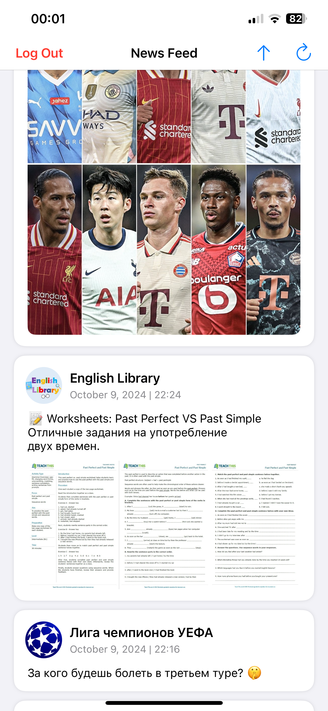
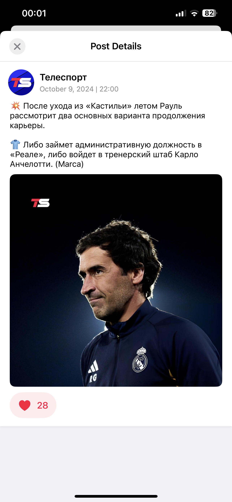

# VKFeed

## Overview

**VKFeed** is a simple iOS app designed to showcase key iOS development skills as part of a job application. Built using **Swift** and **UIKit**, this app allows users to authenticate via [VK](https://vk.com/)'s OAuth2, view their VK news feed, like/unlike posts, and refresh tokens securely. The project demonstrates the integration of modern development technologies, clean architecture principles, and various best practices in iOS development.

## Key Features

- **VK API Integration**: 
  - Authentication using OAuth2.
  - Fetching and displaying the VK news feed.
  - Liking and unliking posts.
  - Token management and refresh.
  - User logout functionality.
  
- **Reactive Programming**: Utilizes **Combine** for managing asynchronous data streams and UI updates.

- **Efficient UI**: 
  - Built with **SnapKit** for concise and responsive layout management.
  - Uses **Kingfisher** to handle image caching and downloading for smoother image loading in the news feed.

- **Persistent Storage**: Tokens are securely stored using **Keychain**, while user preferences are handled with **UserDefaults**.

- **Networking**: Leverages **URLSession** for API requests and secure network communication with VK's API.

- **Architecture**: Implements **Clean Architecture** combined with **MVVM** pattern, providing a modular, testable, and scalable codebase.

- **Refreshing Tokens**: Automatically handles token refresh to keep the session active without interrupting the user experience.

## Architecture

The app is built following the **Clean Architecture** principles and the **MVVM** pattern, ensuring separation of concerns and easy maintainability. The project structure includes:

- **Presentation Layer**: Manages the UI and user interactions.
- **Domain Layer**: Contains business logic, including use cases.
- **Data Layer**: Handles all data-related operations such as networking, storage, and repositories.

## Data Flow

- **Authentication**: The app uses VK OAuth2 for authentication, securely storing tokens in **Keychain**.
- **News Feed Fetching**: VK API is used to fetch and display the user's news feed.
- **Post Interactions**: Users can like/unlike posts, with their interactions synced with the API.
- **Token Refresh**: When a token expires, the app seamlessly refreshes it before making any API calls to maintain session continuity.

## Screenshots

## License

This project is for demonstration purposes and does not include a license.
